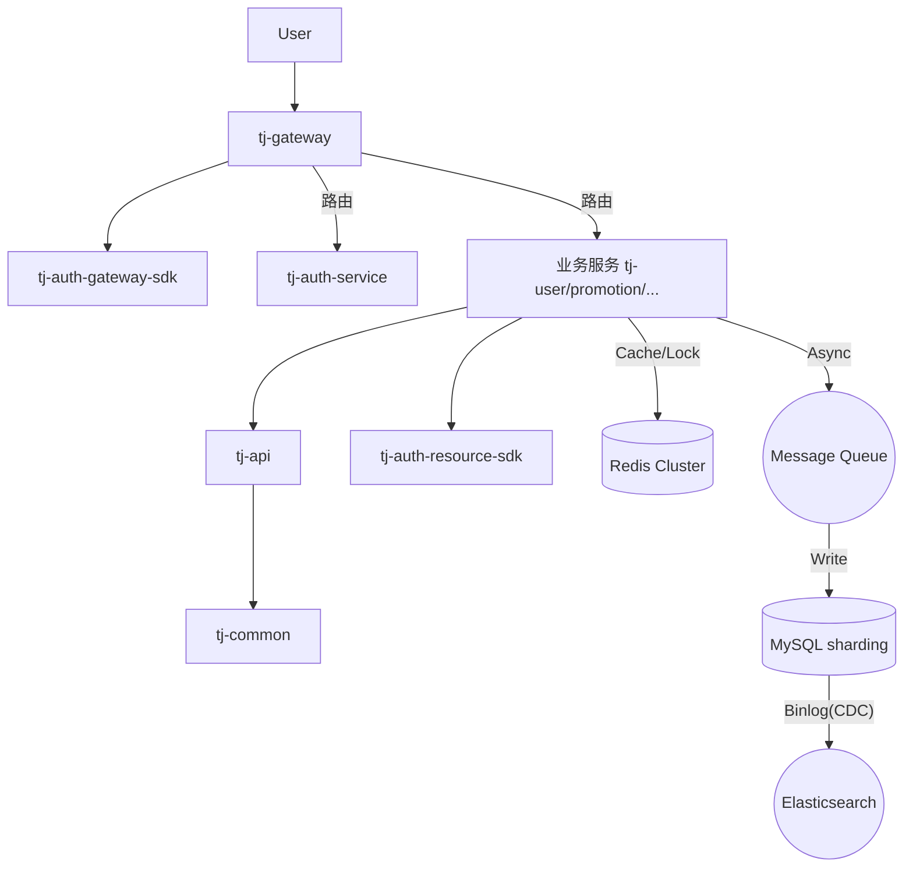

# 智学课堂 (Smart Learning) ：微服务架构设计与高并发优化

> **项目定位**: 本项目基于某大型在线教育平台（天机学堂）重构，重点针对**高并发业务场景**（如秒杀、点赞、排行榜）进行了深度优化与架构升级。不仅包含完整的微服务治理体系，更融入了**Redis 高级应用、消息队列削峰填谷、冷热数据分离、CDC 数据同步**等企业级实战方案。

本报告详细解析了 `tjxt` 项目的架构设计、核心模块交互以及关键的技术难点突破。

## 1. 核心技术亮点与高并发优化 (Highlights)

本项目不仅仅是一个 CRUD 的微服务系统，更在以下关键领域进行了深度优化：

### 1.1. 高并发互动系统设计 (点赞/排行榜)
针对由“点赞”引发的高并发读写挑战，设计了 **Redis + MQ + DB** 的多级缓冲架构：
*   **读写分离与冷热分离**:
    *   **计数器**: 使用 `Redis String` + 本地缓存（Caffeine）处理超高频的点赞数统计，采用 `Write-Behind` 策略异步落库。
    *   **用户状态**: 使用 `Redis ZSet` 存储用户最近的点赞记录（热数据），历史数据（冷数据）通过 **RedisBloom (布隆过滤器)** + 数据库兜底，解决海量数据下的存储成本与查询性能平衡问题。
*   **削峰填谷**: 引入 RocketMQ/RabbitMQ 将瞬间的点赞流量异步化，通过 `Batch` 批量写入数据库，避免数据库在此场景下成为瓶颈。

### 1.2. 海量数据下的学习进度同步
针对用户高频提交视频播放进度（每15秒一次）导致的数据库 TPS 压力：
*   **合并写请求**: 利用 **Redis ZSet** 暂存用户进度，配合延迟队列或定时任务，将同一段时间内的多次状态更新合并为一次 DB 写入。
*   **效果**: 将数据库写压力降低了一个数量级（N:1），同时保证了最终一致性。

### 1.3. 搜索系统的数据同步优化 (CDC)
摒弃了传统的“MQ通知+反查数据库”模式，采用 **CDC (Change Data Capture)** 技术方案：
*   **架构**: 集成 **Canal / Flink CDC** 监听 MySQL Binlog。
*   **优势**: 实现了 **ES 索引与 MySQL 的毫秒级增量同步**，解决了并发修改下的“更新丢失”问题，并大幅减少了服务间的耦合与网络带宽消耗。

### 1.4. 分布式锁与并发安全
在优惠券领取、积分扣减等资金/资产敏感业务中：
*   **Redisson 分布式锁**: 结合 Lua 脚本实现“校验+扣减”的原子性，防止超卖。
*   **高并发积分扣减**: 采用 **Redis 原子计数器 (HINCRBY)** 替代数据库行锁，通过“内存预扣减 + 异步落库”实现高性能的积分流转。

---

## 2. 微服务架构体系概览

项目采用标准的 Maven **多模块 (Multi-module)** 结构，基于 **Spring Cloud Alibaba** 技术栈构建。

*   **根项目 (`tjxt`)**:
    *   **角色**: 父工程 (Parent POM)。
    *   **核心职责**: 版本锁定（Spring Cloud 2021.0.3, Alibaba 2021.0.1.0）、模块聚合与环境配置。

### 2.1. 核心公共模块
*   **`tj-common` (公共工具)**: 提供全局异常处理 (`BizIllegalException`)、Jackson 配置、Hutool 工具集以及 MyBatis Plus/Redis 的基础扩展。
*   **`tj-api` (服务接口)**: 定义 Feign Clients、DTOs 及 Sentinel 熔断降级配置，作为服务间调用的统一契约。
*   **`tj-gateway` (流量网关)**: 基于 Spring Cloud Gateway，集成 `tj-auth-gateway-sdk` 实现非阻塞式的统一鉴权与动态路由。

### 2.2. 鉴权体系 (`tj-auth` 家族)
采用了 **网关鉴权 + 微服务上下文传递** 的双层设计：
*   **`tj-auth-gateway-sdk`**: 部署于网关，基于 Reactor 模型进行 Token 解析与黑名单校验。
*   **`tj-auth-resource-sdk`**: 部署于各微服务，通过拦截器将用户信息注入 `UserContext` (ThreadLocal)，实现业务无感知的身份获取。
*   **`tj-auth-service`**: 独立的认证中心，负责 Token 签发与管理。

## 3. 业务微服务协作模式 (以 `tj-user` 为例)

1.  **请求链路**: User Request -> `tj-gateway` (鉴权通过) -> `tj-user`。
2.  **上下文获取**: `tj-user` 内部直接通过 `UserContext.getUser()` 获取当前用户 ID，无需解析 Token。
3.  **服务调用**: 若需查询课程，直接注入 `CourseClient` (来自 `tj-api`) 发起 Feign 调用。

## 4. 架构交互图示

## 5. 关键设计总结

1.  **鉴权解耦**: 网关负责“进门”，SDK 负责“身份传递”，业务侧零耦合。
2.  **接口抽离**: API 模块化避免了循环依赖。
3.  **极致性能**: 在关键路径（点赞、抢券、学习进度）大量使用 Redis 高级特性与异步架构，显著提升了系统的吞吐量与稳定性。
