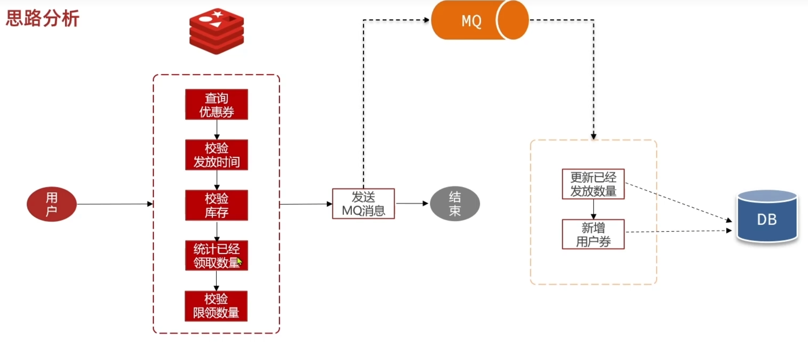
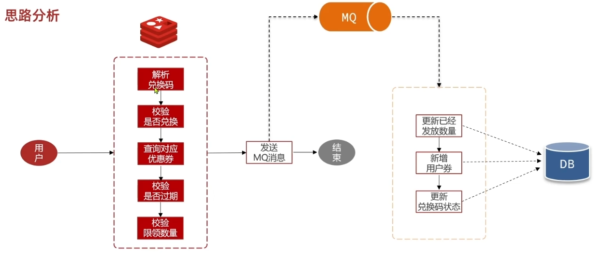
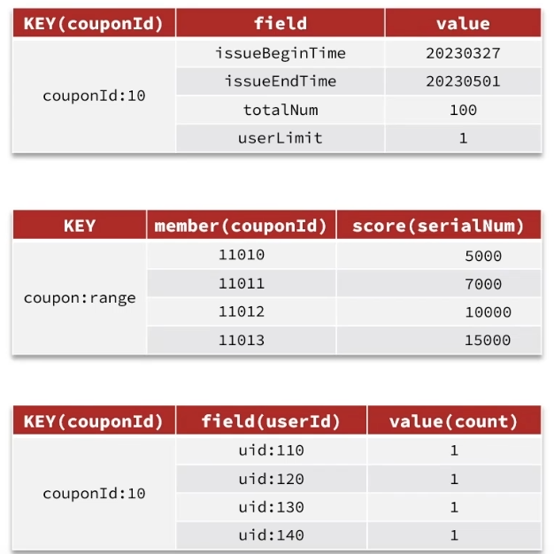

# 高并发优惠券系统优化总结 (Interview/Learning Summary)

**模块**: `tj-promotion` (天机学堂-促销模块)
**核心话题**: 分布式锁、Redis Lua 原子操作、异步解耦、兑换码算法优化

---

## 1. 业务痛点与原始方案

### 1.1 核心流程 (The "Heavy" Flow)
在未优化前，用户“领取优惠券”是一个非常“重”的同步数据库操作流程。不仅涉及多次 DB 读取，还涉及事务内的写锁竞争。

**原始流程图解：**

1.  **用户请求** -> 
2.  **DB查券** (`SELECT * FROM coupon WHERE id = ?`) -> 
3.  **校验时间** (Code Logic) -> 
4.  **校验库存** (`SELECT total_num FROM coupon`) -> 
5.  **校验个人限领** (`SELECT count(*) FROM user_coupon`) -> 
6.  **DB扣减库存** (`UPDATE coupon SET total_num = ...`) -> 
7.  **DB写入用户券** (`INSERT INTO user_coupon`) -> 
8.  **返回成功**


### 1.2 存在的问题
1.  **超卖 (Overselling)**: 多线程并发下，步骤4的库存检查和步骤6的扣减不是原子的，导致库存变成负数。
2.  **超领 (Over-limit)**: 用户短时间内发起多次请求，步骤5的统计在并发下可能失效（都读到 0），导致一个人领了超过限额的券。
3.  **性能瓶颈**: 所有压力都在 MySQL，且事务持有时间过长（包含多次网络IO），无法应对秒杀级流量。

---

## 2. 优化阶段一：分布式锁解决“超领”

**目标**: 解决单个用户领取超过限制数量的问题（如：每人限领1张）。

### 解决方案
使用 **Redisson** 分布式锁。

*   **Key 设计**: `lock:coupon:uid:{userId}`
*   **逻辑**: 
    *   在进入事务前，先对当前 `userId` 加锁。
    *   这就强制同一个用户对同一张券的领取请求变成“串行化”。
    *   即使该用户手速再快，第二个请求也必须等第一个请求事务提交并释放锁后才能执行，此时步骤5 (`SELECT count(*)`) 能读到最新的数据。

> **缺点**: 这只能防住单个用户的并发。对于成千上万不同用户的并发（抢库存），数据库锁竞争依然非常激烈。

---

## 3. 优化阶段二：Redis+MQ 异步解耦 (秒杀架构)

**目标**: 将“领取逻辑”中最耗时的 DB 操作剥离，将“校验逻辑”前置到 Redis。

### 3.1 核心思想
**“Redis 扛读写，MQ 扛持久化”**

我们将流程拆分为两个阶段：
1.  **同步阶段 (Redis)**: 校验库存、校验资格、扣减库存（预扣减）。这个阶段非常快，因为全是内存操作。
2.  **异步阶段 (MQ + DB)**: 真正的数据库落库操作。



### 3.2 改造步骤
1.  **数据预热**: 活动开始前，将优惠券的关键信息（库存 `totalNum`、限领数 `userLimit`、有效期等）载入 Redis Hash 结构。
    *   Key: `prs:coupon:{couponId}`
2.  **Lua 脚本 (Atomic & Performance)**: 
    *   **原子性**: 将“校验”和“扣减”封装在一个 Lua 脚本中，保证原子性，防止超卖和超领。
    *   **减少网络请求**: 在领券或兑换资格校验时，往往涉及多次 Redis 交互（查库存、查限领、查时间等）。如果使用普通命令，每次交互都会产生一次网络请求（RTT）。在高并发场景下，频繁的网络请求会导致网络拥堵，增加业务响应耗时。
    *   **解决方案**: Redis 支持 Lua 脚本，允许在一次请求中发送一段逻辑到服务端执行。这样我们只需要发起 **1次网络请求** 即可完成所有的复杂业务逻辑判断，极大地提升了系统的吞吐能力。
3.  **MQ 发送**: 脚本校验通过后，发送消息到 RabbitMQ，直接给用户返回“领取成功”（或者“排队中”）。
4.  **消费者 (DB Writer)**: 监听 MQ，执行真正的 `UPDATE` 和 `INSERT`。

### 3.3 详细 Lua 逻辑 (`receive_coupon.lua`)
代码位置: `src/main/resources/lua/receive_coupon.lua`

```lua
-- 1. 检查优惠券Key是否存在
if(redis.call('exists', KEYS[1]) == 0) then return 1 end

-- 2. 检查库存 (totalNum)
if(tonumber(redis.call('hget', KEYS[1], 'totalNum')) <= 0) then return 2 end

-- 3. 检查时间 (issueEndTime)
if(tonumber(redis.call('time')[1]) > tonumber(redis.call('hget', KEYS[1], 'issueEndTime'))) then return 3 end

-- 4. 校验个人限领 & 记录个人领取数
-- KEYS[2] 是用户领券计数 Key (prs:user:coupon:{id})
-- 这里直接 hincrby 增加领取数，如果返回值大于 userLimit，说明超领了
if(tonumber(redis.call('hget', KEYS[1], 'userLimit')) < redis.call('hincrby', KEYS[2], ARGV[1], 1)) then
    return 4 
end

-- 5. 扣减公共库存
redis.call('hincrby', KEYS[1], "totalNum", "-1")
return 0
```

---

## 4. 优化阶段三：兑换码异步领取优化

**目标**: 兑换码（Exchange Code）领取也面临同样的 DB 瓶颈。我们需要把兑换码的校验也搬到 Redis 中。

### 4.1 原始痛点
兑换码通常是一张大表 `exchange_code`，包含 `code`, `status`, `user_id`, `coupon_id`。
用户输入 Code -> 查表 -> 检查状态 -> 查关联优惠券 -> ... -> 更新状态。全是 DB 操作。



### 4.2 优化难点
我们可以在 Redis 存兑换码的状态（用 Bitmap），但**如何根据 Code 知道它是哪张优惠券的？**
Redis Bitmap 只有 0/1 (已兑换/未兑换)，存不下 `couponId`。

### 4.3 方案对比

#### 方案 A：自增 ID 范围映射 (作者原始方案)
**核心思路**：利用 Redis 的全局自增计数器为每张优惠券分配一段连续的 SerialNum（序列号）范围，并通过 ZSet 维护范围边界。

1.  **兑换码生成逻辑 (`ExchangeCodeServiceImpl.java`)**:
    *   系统维护一个全局自增 Key (`ic:coupon:code:serial`)。
    *   **生成时**: 假设优惠券 A 需要生成 100 张。
    *   直接调用 `INCRBY 100`，得到这批券的最大序列号 `MaxSerialNum`。
    *   那么，`[MaxSerialNum - 100 + 1, MaxSerialNum]` 这个闭区间就是优惠券 A 的专属 ID 范围。
    *   **记录映射**: 将 `(Member=couponId, Score=MaxSerialNum)` 存入 Redis ZSet (`prs:code:map`)。

2.  **查找逻辑 (Lua 中使用 `ZRANGEBYSCORE`)**:
    *   用户输入的兑换码包含 `SerialNum`。
    *   **查找命令**: `ZRANGEBYSCORE prs:code:map SerialNum (SerialNum + 5000) LIMIT 0 1`
    *   **原理解析**:
        *   我们需要找一个优惠券，它的范围上限（Score）必须 **>=** 当前的 `SerialNum`。
        *   `ZRANGEBYSCORE key min max` 本身是查找 Score 在 min 到 max 之间的元素。
        *   **Min = SerialNum**: 显然，只有 Score >= SerialNum 的优惠券才可能是该 SerialNum 的拥有者。
        *   **Max = SerialNum + 5000**: 这是一个优化限制。因为每个优惠券批次最多生成 5000 张（系统约束），所以该 SerialNum 所属的优惠券的 MaxSerialNum 绝不可能超过 `SerialNum + 5000`。加上这个上限可以避免全表扫描，提升 ZSet 查找性能。
        *   **LIMIT 0 1**: 取出满足条件的第一个（也是 Score 最小的那个），这就是该 SerialNum 所属的最近范围。

3.  **优势**:
    *   不需要修改兑换码的位结构，利用纯数字范围即可定位。
    *   Redis ZSet 范围查找效率高 (O(logN))。

#### 方案 B：位运算/ID 嵌入 (你的优化思路 💡)
*   **思路**: 不依赖外部查找表，直接将 `couponId` 编码进兑换码（serialNum）中。
*   **实现逻辑**:
    *   假设 SerialNum 是 64位 Long。
    *   **高 32 位**: 存储 `couponId`。
    *   **低 32 位**: 存储该券下的流水号。
*   **优点**:
    *   **极致性能**: Lua 脚本中不需要查 `ZRANGEBYSCORE`，直接位运算 `couponId = serialNum >> 32` 即可拿到 ID。
    *   **省空间**: 省去了范围映射的存储 Key。
*   **缺点**:
    *   **ID 长度**: 兑换码生成的数字会很大，转成 Base32 后的字符串也会变长，用户输入体验稍微受影响。
    *   **隐私**: 懂行的用户可能反解出业务 ID（虽然内部 ID 泄露通常风险可控）。

---

## 5. 关键 Redis 数据结构

| Key | 类型 | 存储内容 | 作用 |
| :--- | :--- | :--- | :--- |
| `prs:coupon:{id}` | Hash | `{ "totalNum": 100, "userLimit": 1, ... }` | 缓存优惠券静态信息（库存、有效期、限领数），用于快速校验。 |
| `prs:user:coupon:{id}` | Hash | `{ "{userId}": "1", ... }` | 记录用户已领取该优惠券的数量（Field=userId, Value=count）。用于限领校验。 |
| `prs:code:map` | ZSet | `Member=couponId, Score=MaxSerialNum` | **范围映射表**。Score 是该优惠券批次分配到的最大自增序列号。用于根据 SerialNum 反查 CouponId。 |
| `prs:code:use` | Bitmap | `Offset=SerialNum, Value=0/1` | **兑换状态表**。利用全局唯一的 SerialNum 作为 Offset，0=未兑换，1=已兑换。极度节省空间。 |
| `ic:coupon:code:serial` | String | `Integer` (自增值) | **全局自增计数器**。生成兑换码时使用，确保 SerialNum 全局唯一且单调递增。 |



## 6. 关键代码导航

### Java 入口
*   **类**: `com.tianji.promotion.service.impl.UserCouponServiceImpl`
*   **领券方法**: `receiveCoupon(Long couponId)`
    *   不再调用 DB，直接 `redisTemplate.execute(RECEIVE_COUPON_SCRIPT, ...)`
    *   成功后 `mqHelper.send(...)`
*   **兑换方法**: `exchangeCoupon(String code)`
    *   解析 Code 得到 SerialNum。
    *   `redisTemplate.execute(EXCHANGE_COUPON_SCRIPT, ...)`

### Lua 脚本
*   **领券**: `tj-promotion/src/main/resources/lua/receive_coupon.lua`
    *   逻辑：Check TotalNum -> Check Time -> Check & Incr UserLimit -> Decr TotalNum
*   **兑换**: `tj-promotion/src/main/resources/lua/exchange_coupon.lua`
    *   逻辑：Check Bitmap -> Find CouponId (Range) -> Check Coupon Validity -> Set Bitmap
