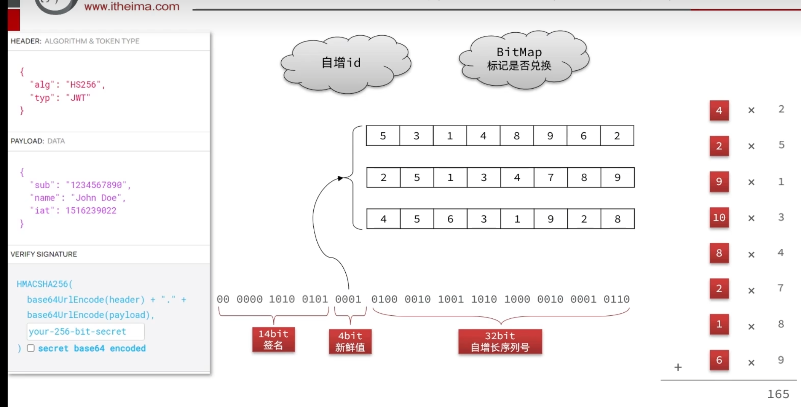

# 为优惠卷生成兑换码的验证架构设计说明

## 1. 核心设计理念

传统的兑换码系统通常采用 "UUID" 或 "随机字符串" 生成并存储在数据库中。当用户兑换时，需要进行全表扫描或索引查找来匹配字符串。这种方式在海量数据下存在以下痛点：
1.  **存储压力大**：亿级兑换码需要大量的数据库存储空间。
2.  **查询效率低**：字符串匹配即使有索引，在高并发下也较慢。
3.  **依赖数据库**：验证真伪强依赖数据库查询。

本项目采用了 **"算法换存储"** 的设计思路：
*   **Redis 自增 ID**：保证兑换码的唯一性。
*   **CodeUtil (动态混淆)**：将有序 ID 转为无序字符串，且支持**自校验**，无需查库即可验证真伪。
*   **10位(Base32)字符串**：本质就是一个50bit的2进制串，效仿JWT的思想(自增id(用户信息)+签名(加权求和书)+密钥(权重数组))。
*   **动态混淆算法**：将有序的自增 ID 转化为无序、随机的由 Base32 编码的字符串，且支持**自校验**。
*   **Redis BitMap + 数据库**:
    *   **BitMap**：作为**防重保护层**（类似精准的布隆过滤器），以极小的内存占用快速判断兑换码是否已被使用，阻挡重复请求打入数据库。

    *   **数据库**：仅存储兑换成功的业务数据（如“用户A领取了优惠券B”），而**不需要预先存储那 1 亿个兑换码字符串**。

---

## 2. 架构流程图解

### 2.1 核心组件
1.  **Redis Incr**：用于生成全局唯一的序列号（SerialNum），如 1, 2, 3...
2.  **CodeUtil (核心算法)**：负责将简单的序列号“伪装”成复杂的兑换码，以及将兑换码“还原”为序列号。
3.  **Redis BitMap**：用于标记某个序列号是否已被使用。

---

## 3. 兑换码生成过程 (加密/混淆)

目标：将有序的数字（如 1）变成看着像乱码的字符串（如 `H7K2-9B3M-X1`）。

### 步骤详解：

1.  **输入准备**：
    *   `SerialNum` (32位)：由 Redis 自增生成，唯一标识。
    *   `Fresh` (4位)：新鲜值，通常取优惠券 ID 的后 4 位。用于区分不同批次的券，实现算法隔离。

2.  **组装载荷 (Payload Assembly)**：
    *   将 `Fresh` 和 `SerialNum` 拼接。
    *   `Payload (36位) = Fresh(高4位) + SerialNum(低32位)`。
    *   *此时数据还是有序的。*

3.  **数字签名 (CheckCode Calculation)**：
    *   **加权求和**：根据 `Fresh` 值，从预定义的 `PRIME_TABLE` (质数表) 中选择一组权重。
    *   将 Payload 每 4 位一组，乘以对应的权重并求和。
    *   截取结果的后 14 位作为 `CheckCode` (校验码)。
    *   *作用：相当于给数据盖了个“防伪印章”。*

4.  **动态混淆 (Dynamic Obfuscation) —— "大素数污染"**：
    *   **选钥匙**：利用刚才算出的 `CheckCode` 的后 5 位作为索引，从 `XOR_TABLE` (异或密钥表) 中随机选取一个巨大的素数作为 Key。
    *   **污染数据**：`NewPayload = Payload ^ Key`。
    *   *原理*：因为 `CheckCode` 对数据变化极度敏感，序列号变一点，`CheckCode` 就变，选的 Key 就变。导致最终异或出的结果天差地别。这是实现“有序转无序”的关键。利用的是密码学中的雪崩效应。

5.  **最终封装与编码**：
    *   `RawData (50位) = CheckCode(高14位) + NewPayload(低36位)`。
    *   使用自定义的 Base32 算法（去除了易混淆字符 I, L, O, 1, 0）将 50 位整数转为 10 位字符串。

---

## 4. 兑换码验证过程 (解密/自证)

目标：判断兑换码是否合法，且**无需查询数据库**。

### 步骤详解：

1.  **格式校验**：
    *   使用正则表达式校验长度和字符集是否合法。

2.  **解码 (Base32 Decode)**：
    *   将字符串还原为 50 位的整数 `RawData`。

3.  **分离头部与身体**：
    *   **头部 (CheckCode)**：提取高 14 位。这是生成时盖的“印章”。
    *   **身体 (Masked Payload)**：提取低 36 位。这是被“污染”过的数据。

4.  **去污 (De-obfuscation)**：
    *   **找回钥匙**：系统直接利用提取出的头部 `CheckCode` (后5位)，去 `XOR_TABLE` 表里找到生成时用的同一把 Key。
    *   **还原数据**：`OriginalPayload = MaskedPayload ^ Key`。
    *   利用异或的可逆性 (`A ^ B ^ B = A`)，我们还原出了原始的 `Fresh` 和 `SerialNum`。

5.  **自证清白 (Self-Verification)**：
    *   系统拿着还原出来的 `Fresh` 和 `SerialNum`，**重新运行一遍签名算法**，计算出一个 `NewCheckCode`。
    *   **对比**：`NewCheckCode` vs `提取出的 CheckCode`。
    *   **判定**：
        *   **相等**：说明兑换码是真实的，没有被篡改。
        *   **不等**：说明是伪造的或被篡改的，直接抛出异常。

---

## 5. 状态记录与防重 (BitMap + DB 双重保障)

验证通过后，如何防止一张券被兑换两次，并保证数据完整性？

### 5.1 BitMap 的作用：高效防重与保护

*   **传统方案**：
    *   在数据库建表 `coupon_code`，字段 `status` (0:未兑换, 1:已兑换)。
    *   兑换时 `SELECT * FROM table WHERE code = 'xxx'`。
    *   *缺点*：需要存储字符串，空间占用大，查询慢。

BitMap 在这里充当了“精准的布隆过滤器”的角色。

*   **本项目 BitMap 方案**：
    *   **原理**：利用解密出的 `SerialNum` (如 10086) 作为 BitMap 的下标 (Offset)。
    *   **流程**：
    *   1.**验签**：算法自证，拦截伪造码。
    *   2.**查重 (BitMap)**：`GETBIT {key} {SerialNum}`。
    *   *   返回 1：**拦截！** 说明该码已被消费，直接报错，**完全不涉及数据库操作**。
    *   *   返回 0：**放行**，进入数据库业务流程。
    *   **优势**：
    *   *   **保护数据库**：绝大多数重复请求、恶意重放请求会被 BitMap 挡在缓存层。
    *   *   **极省空间**：1 亿个状态仅需 ~12MB 内存。

* 
  *   我们通过算法还原出了 **`SerialNum` (序列号)**，它是一个从 1 开始的连续整数。Redis自增数对应bitmap的具体位置。
  *   天然适合作为 **BitMap (位图)** 的下标（Offset）。
  *   **Redis 命令**：
      *   **判断是否兑换**：`GETBIT {key} {SerialNum}`
          *   返回 0：未兑换 -> 执行兑换逻辑。
          *   返回 1：已兑换 -> 报错“重复兑换”。
      *   **标记已兑换**：`SETBIT {key} {SerialNum} 1`

---

## 6. 安全性总结

1.  **防遍历**：由于异或混淆的存在，序列号 `1` 和 `2` 生成的码完全不同，攻击者无法通过已知的码推算出下一个码。
2.  **防伪造**：攻击者不知道后端的 `PRIME_TABLE` (加权参数) 和 `XOR_TABLE` (混淆密钥)，随便造的字符串解密后无法通过 CheckCode 的校验。
3.  **高性能**：
    *   生成：纯内存位运算，毫秒级。
    *   校验：纯计算验证，无 DB IO。
    *   防重：Redis BitMap，O(1) 复杂度。
