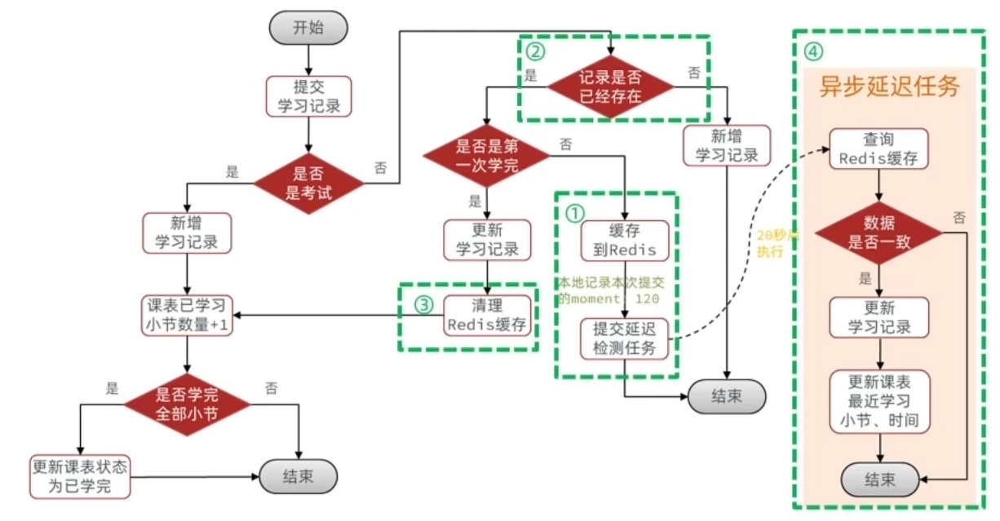

# 天机学堂项目架构改进与思考记录

## 1. 海量数据过期策略优化（"宽松过期"策略）
- **背景**：
    - 原系统可能需要实时检查课程或课表是否过期（精确到秒），或者依赖高频轮询，这对数据库（MySQL）压力极大，且在千万级数据量下难以保证实时性。
- **改进方案**：
    - **业务对齐**：将所有课程/课表的有效期截止时间，在落库时统一对齐到当天的 `23:59:59`。
    - **分片调度**：利用 **XXL-JOB 分片广播** 机制，配合“宽松过期”业务定义，仅在每日凌晨（低峰期）执行一次批量扫描更新。
- **价值**：
    - 避免了全天候高频扫描数据库，将数据库压力降低了 **90%** 以上。
    - 既然业务上允许“按天计算有效期”，这种设计在满足业务一致性的前提下，极大地节省了计算资源。

## 2. 学习记录高频写入优化（Redis 延迟队列/缓冲）
- **背景**：
    - 用户在学习视频时，前端会高频提交播放进度（例如每 15 秒一次,原系统使用JVM延时队列实现合并写入，但是在分布式情况下会导致失效。
    - 如果每次提交都直接 update 数据库 (`learning_record` 和 `learning_lesson`)，会导致数据库 TPS 飙升，且大部分是中间状态的无效写（只有最后一次进度是有用的）。
    
- **改进方案**：
    
    - **Redis 缓冲**：前端提交进度时，先写入 Redis (`ZSet` 或 `Hash`)，不直接写库。
    - **延迟合并**：利用 **Redis 延迟队列**（或者简单的定时任务），将同一个用户对同一个小节的一段时间内的多次提交进行**合并**。
    - **批量落库**：每隔一段时间（如 1 分钟）或在用户暂停/离开页面时，将 Redis 中的最新进度批量刷入 MySQL。
    
    
    
- **价值**：
    - 将数据库的写操作减少了 **一个数量级**（从 N 次减少到 1 次）。
    - 解决了高并发下的数据库写入瓶颈。

## 3. 搜索数据同步架构的极致优化 (CDC + 局部更新)
- **现状与问题**：
    - 原系统采用 **"MQ 通知 + 全量反查覆盖"** 策略。即：修改任意字段（如只改个名字），MQ 发送 ID，Search 服务反查 MySQL 全量数据，然后调用 ES `save` (Upsert)。
    - **痛点**：
        1.  **带宽浪费**：对于大文档（包含长描述/HTML），修改一个小字段却同步所有数据，IO 损耗大。
        2.  **并发冲突**：若运营 A 改名，运营 B 改价，两条消息并发到达，全量覆盖会导致**后到的覆盖先到的**，造成数据回滚 (Lost Update)。
        3.  **耦合重**：业务代码 (CourseService) 必须显式发送 MQ。
- **优化方案：基于 Binlog 的 CDC (Change Data Capture)**
    - **架构**：引入 **Canal / Flink CDC** 监听 MySQL Binlog，将变更事件投递到 Kafka。
    - **策略**：
        - **局部更新**：消费者解析 Binlog，识别出仅变更了 `name` 字段，调用 ES `UpdateRequest` 仅更新该字段。
        - **并发控制**：利用 Binlog 的严格顺序性（或版本号 Version），确保 ES 更新顺序与 MySQL 一致。
- **价值**：
    - **解耦**：业务代码零侵入，不再需要手动发 MQ。
    - **性能**：大幅减少网络传输量和 ES 索引重建开销。
    - **一致性**：解决了并发修改导致的数据覆盖问题。

- **其他备选方案对比**：
    - **方案 B：精细化 MQ + 局部更新**
        - **逻辑**：业务代码检测到字段变更（如仅 name 变了），发送带具体变更字段的消息 `{id:1, fields:{name:"new"}}`。
        - **优点**：不需要引入 Canal/Kafka 等重型中间件。
        - **缺点**：业务代码耦合极重，Service 层充斥着复杂的 diff 逻辑。
    - **方案 C：版本号机制 (Versioning) / 乐观锁**
        - **逻辑**：MySQL 和 ES 都维护 `version` 字段。写入时校验 `msg.version > es.version`。
        - **优点**：完美解决并发乱序问题。
        - **缺点**：无法解决带宽浪费问题（依然需要全量传输），且需要修改数据库表结构。

## 4. 分布式主键选型策略：雪花算法 vs 数据库自增
- **核心权衡点**：
    - **雪花算法 (Snowflake)**：侧重**全局唯一性**与**扩展性**。生成的 ID 趋势递增，但不保证严格连续。
    - **自增 ID (Auto Increment)**：侧重**写入性能**。由 MySQL 维护，保证主键索引的严格顺序插入。
- **业务应用场景**：
    - **场景 A：核心业务表 (订单、课程、用户)**
        - **选型**：**雪花算法** (MyBatis Plus ASSIGN_ID)。
        - **理由**：微服务环境下多实例生成 ID 不冲突；天然适配分库分表（ID 不重复）；隐藏业务量信息，防止外部探测。
    - **场景 B：海量流水型业务 (点赞记录、日志、埋点)**
        - **选型**：**数据库自增 ID**。
        - **理由**：
            1. **极致写入性能**：点赞场景写并发极高，自增 ID 保证了 B+ 树主键索引的严格顺序写，极大地减少了磁盘页分裂与碎片化。
            2. **业务解耦**：点赞业务几乎不按主键 ID 查询（通常按 user_id 或 biz_id 联合索引查询），ID 仅作为占位主键，其全局唯一性并非核心诉求。
- **总结 (Trade-off)**：
    - 在架构设计中，**没有无脑的 Snowflake**。对于“高频写、弱 ID 关联”的边缘业务，回归传统的自增 ID 往往能换取更好的数据库吞吐量。

## 5. 积分系统性能优化：Redis原子计数器替代DB聚合 (Check-Then-Act 优化)
- **背景与痛点**：
    - 积分获取存在“每日上限”逻辑（如：每日看视频最多得50分）。
    - 现有逻辑：每次加分前，先查库 (SELECT SUM) 统计今日已得分数，再判断是否写库 (INSERT)。
    - **性能杀手**：
        1.  **读写放大**：每一次高频行为（看视频）都伴随一次昂贵的数据库聚合查询。
        2.  **并发Bug**：高并发下，“查”与“写”非原子操作，导致积分超发。
- **优化方案**：
    - **Redis 原子计数**：引入 Redis Hash 结构 points:today:{date}:{uid} 记录今日得分。
    - **逻辑变更**：
        1.  请求先打到 Redis，执行 HINCRBY 原子递增。
        2.  **内存拦截**：若 Redis 返回值 > 上限，且溢出部分扣除后无剩余积分，直接返回（0次 DB 操作）。
        3.  **过期时间**：过期时间设置成一天。
        4.  **持久化**：仅当 Redis 判断“还有分可拿”时，才向 MySQL 插入流水记录。
    - **故障恢复**：若 Redis 宕机，通过查询 MySQL 流水重建当日计数器（Lazy Load 或启动时加载）。
- **价值**：
    - **性能提升**：将高频的“聚合查询”转化为 Redis 的 O(1) 操作。对于已刷满分的用户（绝大多数活跃用户），**数据库负载降为 0**。
    - **数据一致性**：Redis 保证原子性解决超发问题；MySQL 保证数据最终持久化不丢失。
