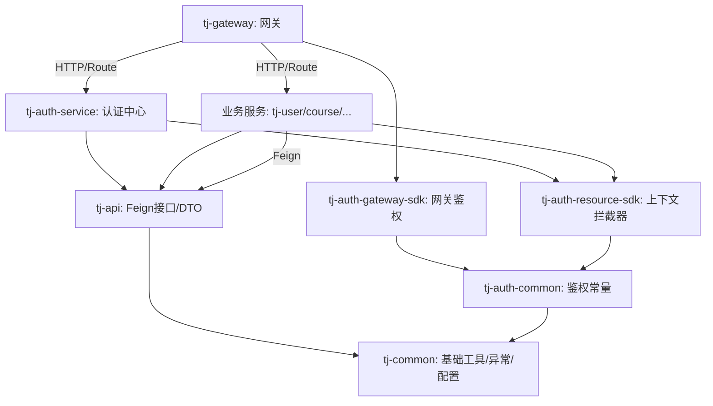

# 天机学堂 (Tianji) 微服务架构与依赖关系详解

本报告专注于 `tjxt` 项目的内部架构组织、Maven 模块依赖关系、公共组件职责划分以及微服务之间如何通过标准化接口进行协同。

## 1. Maven 构建体系与模块概览

项目采用标准的 Maven **多模块 (Multi-module)** 结构，通过顶层父工程进行版本管理和构建统筹。

### 1.1 根项目 (`tjxt`)
*   **角色**: 父工程 (Parent POM)。
*   **核心职责**:
    *   **版本锁定**: 利用 `dependencyManagement` 统一管理 Spring Cloud (2021.0.3), Spring Cloud Alibaba (2021.0.1.0), MyBatis Plus 等核心依赖版本，确保子模块无版本冲突。
    *   **模块聚合**: 通过 `<modules>` 聚合所有业务与基础模块。

### 1.2 模块分类
*   **基础架构层**: `tj-common`, `tj-gateway`, `tj-auth` (SDKs).
*   **服务契约层**: `tj-api`.
*   **业务服务层**: `tj-user`, `tj-course`, `tj-promotion`, `tj-trade` 等。

---

## 2. 核心公共模块解析

这些模块是架构的基石，不承载具体业务，而是提供通用能力与标准契约。

### 2.1 `tj-common` (底层通用工具)
*   **定位**: 所有模块的公共依赖（Base Library）。
*   **包含内容**:
    *   **工具集**: Hutool, Jackson 配置。
    *   **异常体系**: 定义 `BizIllegalException` 等全局异常及 `GlobalExceptionHandler`。
    *   **基础扩展**: MyBatis Plus 的 `MetaObjectHandler` (自动填充)，Redis/MQ 的序列化配置。
*   **依赖策略**: 采用 `provided` 作用域引入可选依赖（如 AMQP），避免强行给业务服务引入不必要的 Jar 包。

### 2.2 `tj-api` (服务接口契约)
*   **定位**: 微服务间通信的桥梁（Feign Clients）。
*   **依赖**: `tj-common` + `OpenFeign` + `Sentinel`。
*   **核心职责**:
    *   **Feign Client**: 定义对外暴露的 API 接口（如 `UserClient`, `CourseClient`）。
    *   **DTO**: 定义跨服务传输的数据模型。
    *   **熔断降级**: 集成 Sentinel 降级逻辑，保护调用方。
*   **使用方式**: 业务服务（如 `tj-order`）只需引入 `tj-api`，即可直接注入 `UserClient` 调用用户服务，无需关心 HTTP 细节。

### 2.3 `tj-gateway` (统一网关)
*   **定位**: 外部流量入口。
*   **依赖**: `tj-auth-gateway-sdk`, `Spring Cloud Gateway`, `Nacos Discovery`.
*   **职责**:
    *   **路由**: 根据路径断言转发请求到下游微服务。
    *   **鉴权**: 集成 `tj-auth-gateway-sdk` 进行 Token 解析与验证。
    *   **负载均衡**: 客户端负载均衡。

---

## 3. 鉴权体系 (`tj-auth`) 的解耦设计

鉴权逻辑被拆分为独立服务与 SDK，适配不同的运行环境（Reactive vs Servlet）。

| 模块名称 | 定位 | 运行环境 | 核心职责 |
| :--- | :--- | :--- | :--- |
| **tj-auth-common** | 通用包 | - | 定义 UserDetail, Payload, 常量 |
| **tj-auth-service** | **独立微服务** | Servlet | 登录接口、Token 签发 (JWT)、管理后台权限 |
| **tj-auth-gateway-sdk** | **网关插件** | **WebFlux** | 部署在网关，负责非阻塞 Token 校验、请求放行 |
| **tj-auth-resource-sdk** | **服务插件** | Servlet | 部署在业务服务，拦截请求，解析 Header 用户信息到 ThreadLocal |

---

## 4. 微服务协作与依赖流程

以 **“用户服务 (`tj-user`)”** 为例，展示一个标准微服务在架构中的位置与依赖关系。

### 4.1 Maven 依赖配置
一个典型的业务微服务 `pom.xml` 通常包含：
```xml
<dependencies>
    <!-- 1. 基础工具与Web支持 -->
    <dependency>
        <groupId>com.tianji</groupId>
        <artifactId>tj-common</artifactId>
    </dependency>
    <!-- 2. 获取当前登录用户信息 (ThreadLocal) -->
    <dependency>
        <groupId>com.tianji</groupId>
        <artifactId>tj-auth-resource-sdk</artifactId>
    </dependency>
    <!-- 3. 调用其他微服务 (如查询课程) -->
    <dependency>
        <groupId>com.tianji</groupId>
        <artifactId>tj-api</artifactId>
    </dependency>
    <!-- 4. Nacos 服务发现 -->
    <dependency>
        <groupId>com.alibaba.cloud</groupId>
        <artifactId>spring-cloud-starter-alibaba-nacos-discovery</artifactId>
    </dependency>
</dependencies>
```

### 4.2 请求处理全链路
1.  **网关拦截 (Gateway)**: 用户请求到达 `tj-gateway`，触发 `tj-auth-gateway-sdk` 校验 Token。若合法，解析出 `UserId` 放入 HTTP Header (`user-info`)，转发请求。
2.  **服务接收 (Service)**: 请求到达 `tj-user`。`tj-auth-resource-sdk` 注册的拦截器 (`HandlerInterceptor`) 拦截请求。
3.  **上下文填充**: 拦截器从 Header 读取 `user-info`，构造 `UserDetail` 对象存入 `UserContext` (ThreadLocal)。
4.  **业务处理**: Controller/Service 层代码通过 `UserContext.getUser()` 获取当前用户 ID，执行业务逻辑。
5.  **远程调用 (Feign)**: 若需查询积分，通过 `tj-api` 中的 `PromotionClient` 发起调用。

---

## 5. 架构依赖关系图


## 6. 补充解析：鉴权体系通俗理解 (Q&A)

### 6.1. 为什么有两个 Common？

*   **`tj-common` (全局通用工具箱)**
    *   **比喻**：这是一把 **螺丝刀、锤子、普通话词典**。
    *   **谁用**：所有人（网关、用户服务、订单服务、鉴权服务）都要用。
    *   **内容**：`JsonUtils`（JSON转换）、`DateUtils`（时间工具）、全局异常处理。因为它太基础了，所以单独拿出来。

*   **`tj-auth-common` (鉴权专用字典)**
    *   **比喻**：这是 **安保部门的专用术语手册**。
    *   **谁用**：只有跟“安保”有关的人才看。
    *   **内容**：定义了什么叫“用户信息 (UserDetail)”、什么叫“权限载荷 (Payload)”。
    *   **设计目的**：为了解耦。如果开发一个完全不需要登录的独立微服务，就不需要引入这一堆安保术语。

### 6.2. 为什么 Auth 拆成了 Service 和 两个 SDK？

这就像 **“办证大厅”** 和 **“查证关卡”** 的区别，以及 **技术栈不兼容** 导致的分离。

#### A. `tj-auth-service` —— 【办证大厅】
*   **角色**：唯一的 **“核心部门”**。
*   **功能**：你没有证件（Token）时，必须来这儿。输入账号密码，它发一张证（Token）。
*   **独立性**：它是独立运行的微服务。

#### B. `tj-auth-gateway-sdk` —— 【大楼门口的保安】
*   **位置**：部署在 **网关 (tj-gateway)** 上。
*   **难点**：网关使用 **WebFlux (Reactor)** 技术（异步非阻塞），与普通 Java Web (Servlet) **完全不兼容**。
*   **功能**：
    1.  拦截请求。
    2.  校验 Token 真伪。
    3.  **通过**：解析 Token 中的用户信息（如 UserID），写入请求头，放行。
    4.  **失败**：直接拒绝。

#### C. `tj-auth-resource-sdk` —— 【办公室门口的门禁】
*   **位置**：部署在 **业务微服务 (tj-user, tj-course)** 上。
*   **难点**：业务服务使用 **Spring MVC (Servlet)**（传统阻塞式 IO），无法使用网关的 SDK。
*   **功能**：
    1.  假设请求已由网关安检通过。
    2.  **自动填表**：从网关传来的请求头中提取“用户ID”。
    3.  **上下文填充**：存入 `UserContext` (ThreadLocal)，方便业务代码通过 `UserContext.getUser()` 直接获取当前用户。

### 6.3. 一个请求的完整流转（人话版）

假设**用户小明**要“查询自己的课程”：

1.  **APP 发送请求** -> **`tj-gateway` (网关)**
    *   *(触发 `tj-auth-gateway-sdk`)*
    *   **保安（SDK）**：检查 Token。
    *   **动作**：Token 有效，解析出 `UserID: 888`，将其写入 HTTP 请求头 `user-info: 888`，放行。

2.  **网关转发** -> **`tj-course` (课程微服务)**
    *   *(触发 `tj-auth-resource-sdk`)*
    *   **门禁（SDK）**：收到请求，读取请求头中的 `user-info: 888`。
    *   **动作**：将 `888` 存入当前线程的 `ThreadLocal`。

3.  **进入 Controller 业务代码**
    *   **代码执行**：调用 `UserContext.getUser()`。
    *   **结果**：直接拿到 `888`，执行数据库查询。