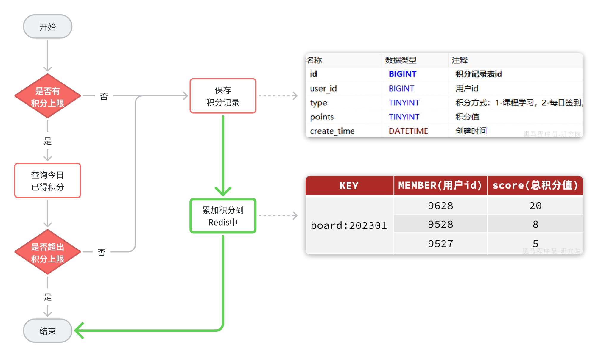
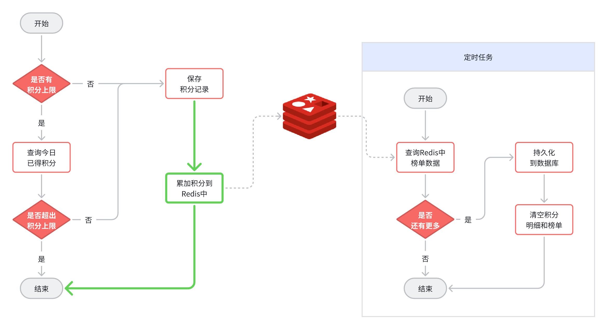

# 天机学堂 - 积分排行榜架构设计与难点总结

## 1. 业务背景与挑战
*   **场景描述**：学员学习积分的实时排行榜，按赛季（自然月）重置。
*   **核心挑战**：
    *   **高并发读写**：用户学习行为频繁产生积分，排行榜需实时更新。
    *   **海量数据**：累计用户量大，单月数据可能达百万级。
    *   **数据归档**：赛季结束后需将 Redis 数据持久化到 MySQL，并清空 Redis 开启新赛季。

## 2. 总体架构设计 (读写分离 + 冷热分离)

*   **热数据 (Redis ZSet)**：
    *   利用 Redis 的 `Sorted Set` 数据结构，天然支持根据 Score (积分) 排序。
    *   `ZADD` 实现高性能写入，`ZREVRANGE` 实现 TopN 高效读取。
    *   **0/1 页码规范**：业务层/接口层统一使用 **1-based** 页码（对人友好），底层数据库/Redis 查询自动转换为 **0-based** 偏移量（对机器友好）。

*   **冷数据 (MySQL)**：
    *   **分表策略**：采用**水平分表**，每个赛季（月份）一张表（如 `points_board_39`, `points_board_40`），避免单表过大影响性能。
    *   **动态路由**：利用 MyBatis Plus 的 `DynamicTableNameInnerInterceptor` 拦截器。
        *   **原理**：通过 `ThreadLocal` 传递目标表名，拦截器拦截 SQL 并动态替换表名。
        *   **优势**：业务代码与分表逻辑解耦，代码中只操作逻辑表名 `points_board`。

## 3. 核心难点与解决方案 (分布式调度 XXL-JOB)

针对月初“赛季切换”这一高危操作，设计了三个独立的分布式任务：

### 3.1 任务一：创建新赛季表 (幂等性设计)
*   **逻辑**：为上一个已结束的赛季创建归档表。
*   **创新/细节**：
    *   **幂等性保障**：建表 SQL 必须包含 **`IF NOT EXISTS`**。
    *   **原因**：防止分布式任务因网络抖动重试时，导致“Table already exists”报错，增强系统健壮性。
    
    

### 3.2 任务二：数据持久化 (分片广播 + 读写优化)
*   **逻辑**：将 Redis 中的上赛季数据全量同步到 MySQL。
*   **高性能设计**：
    *   **分片广播 (Sharding)**：利用 XXL-JOB 的 `ShardIndex` (当前分片序号) 和 `ShardTotal` (总分片数)。
    *   **并发拉取**：不同实例并发拉取 Redis 数据（`pageNo = index + 1`, `step = total`），成倍提升吞吐量。
    *   **存储优化**：直接复用 Redis 中的 **排名 (Rank)** 作为 MySQL 表的 **ID**，既节省空间又保留了排名信息。
*   **深度分页 (Deep Paging) 的思考**：
    *   *面试防御*：虽然 Redis `ZREVRANGE` 存在深度分页性能衰减（O(K+N)），但作为低频离线任务，当前架构完全能承载百万级数据。
    *   *未来优化*：若数据量达千万级，可采用 **Cursor 游标法** 或 **Redis 分桶 (Sharding)** 策略。
    
    

### 3.3 任务三：清理旧数据 (BigKey 优化)
*   **逻辑**：清空 Redis 中上赛季的 Key。
*   **隐患**：排行榜 Key 是典型的 **BigKey**（包含数百万成员），直接 `DEL` 会阻塞 Redis 主线程，导致线上服务卡顿。
*   **解决方案**：
    *   使用 **`UNLINK`** 命令（Redis 4.0+）。
    *   **效果**：将删除操作交给后台线程异步处理，主线程立即返回，**零阻塞**。

## 4. 架构演进思考 (面试加分项)

如果用户量从百万级增长到亿级，当前架构如何升级？

1.  **Redis BigKey 拆分**：
    *   将一个大的 `points_board` ZSet 根据 UserID Hash 拆分为 100 个小 ZSet (`points_board_0` ... `points_board_99`)。
    *   读取 TopN 时在内存中进行归并排序 (MapReduce 思想)。
2.  **流水式持久化 (Write-Behind)**：
    *   不再依赖月末一次性全量同步。
    *   引入 MQ，积分变更时异步写入 MySQL，月末仅做最终一致性校验，削峰填谷。
